# __Three Tier Architecture using Terraform__

## Introduction
This project implements a Three-Tier Architecture on AWS using Terraform (Infrastructure as Code).
The architecture is designed with network isolation, security, scalability, and automation in mind.

## Architecture Diagram
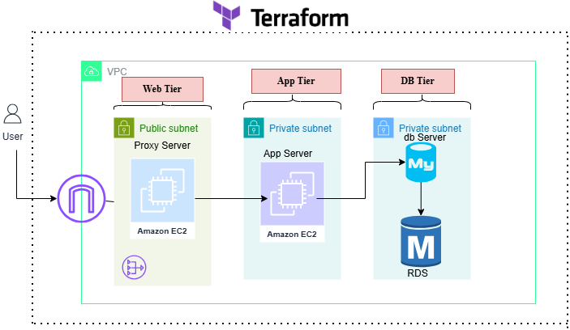

Terraform provisions the entire infrastructure, including networking, compute, and security components.

## Architecture Breakdown
1. Web Tier (Presentation Layer)
EC2 instances in public subnets
Internet-facing
Handles HTTP traffic

2. Application Tier (Business Logic)
* EC2 instances in private subnets
* Communicates only with Web  Tier and Database Tier
* No direct internet access

3. Database Tier (Data Layer)
* EC2 instance in private subnet  
*  Accessible only from Application Tier                        A

## Deployment Steps

#### Step-1:  Write following configuration files:-
* main.tf
* variable.tf
* output.tf
  
#### Step-2: Apply Infrastructure
Use the following command to apply the above infrastructure

      terraform init
      terraform plan
      terraform apply --auto-approve

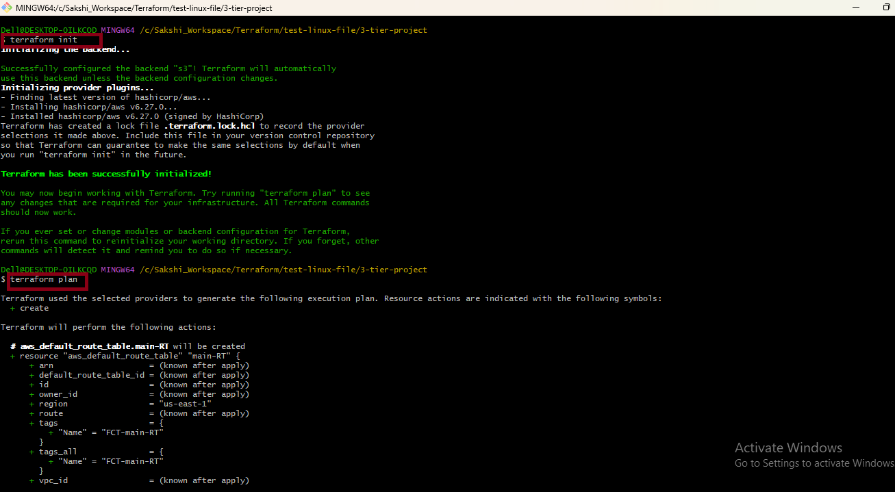      

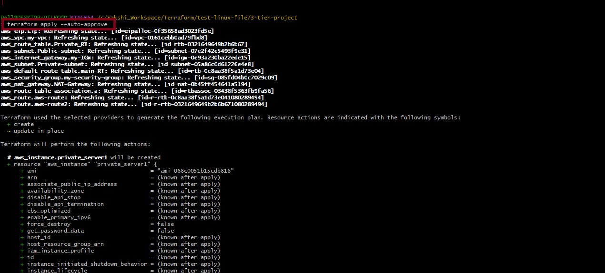
* Here is the final Output
  
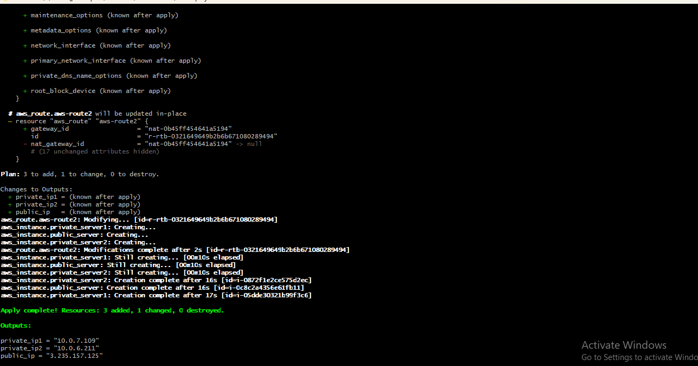
## Resources Created After terraform apply
Once the terraform apply command is executed successfully, Terraform provisions the following AWS resources:

#### Terraform backend bucket
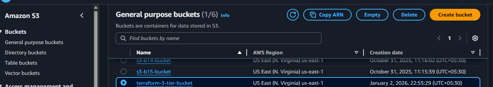

### Networking Resources
#### 1. One VPC

* Custom CIDR block for isolated networking
  
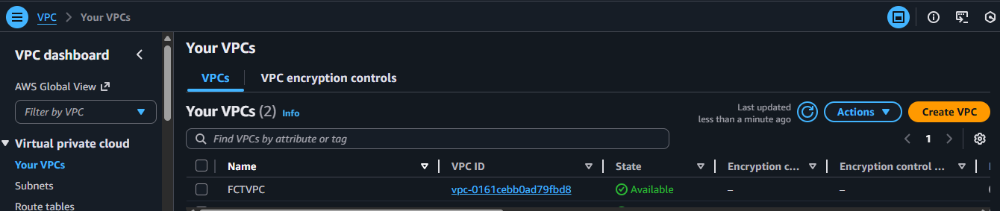

#### 2. Subnets
1. Public Subnet (Web Tier)

2. Private Subnets (App Tier & Database Tier)

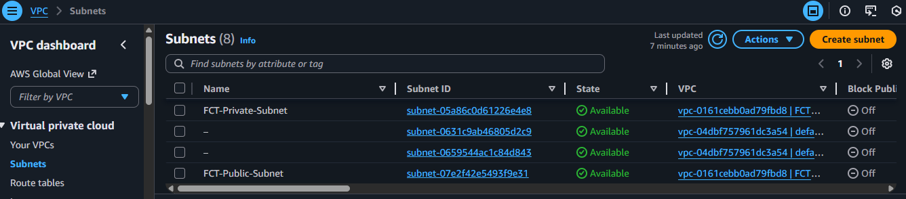

#### 3. Two Route Tables

* Public route table with internet gateway route
* Private route table with NAT Gateway route
* Route Table Association
  * Associates public subnet with internet route table

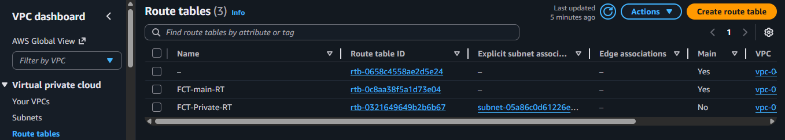

#### 4. One Internet Gatewaye (IGW)
* Enables internet access for public subnet

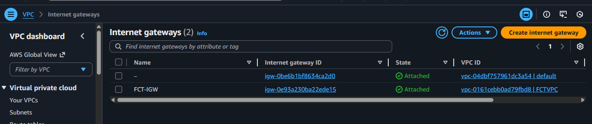

#### 5. NAT Gateway and Elatic IP 
* NAT Gateway created in public subnet
  
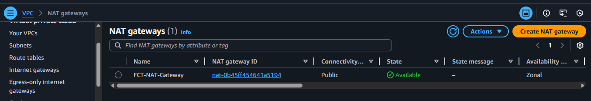

* Elastic IP attached only to NAT Gateway
  
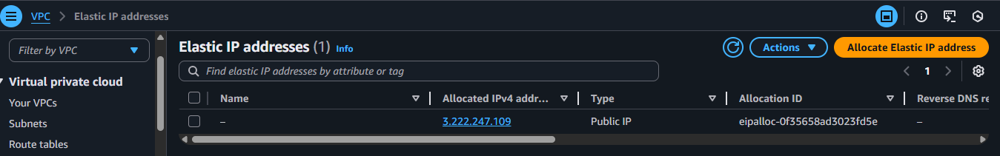

#### 6. Security Group

* Allows HTTP (Port 80) and SSH(22) from the internet
* Allows MySQL traffic only from App Tier on Port 3306

#### 7. Three EC2 Instances

1. Web Tier EC2
* Deployed in public subnet
* Public IP assigned
2. Application Tier EC2
* Deployed in private subnet
* No public access
3. Database Tier EC2
* Deployed in private subnet
* Fully isolated from internet
  
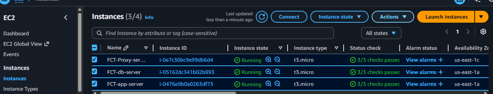
 #### Security Design
* Web Tier → Internet access allowed

* App Tier → Only Web Tier access

* DB Tier → Only App Tier access

* Private subnets prevent direct exposure 
  
## Conclusion:  
This project demonstrates how Terraform can automate deployment of a secure, scalable Three-Tier Architecture on AWS. It follows real-world DevOps best practices and is suitable for learning, interviews, and production-ready designs.

## Access Terraform Source Code

All Terraform configuration files used to build this three-tier architecture are available in this repository.

Clone the repository to get started:      

    git https://github.com/Sakshikarle15/3-tier-project-using-Terraform.git
